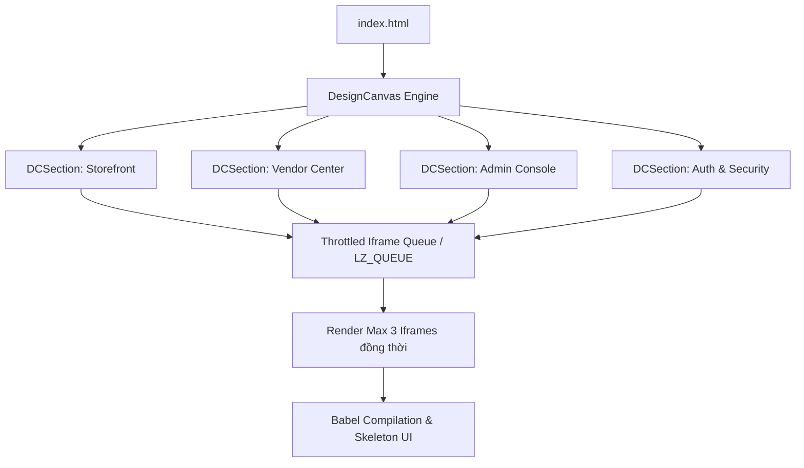
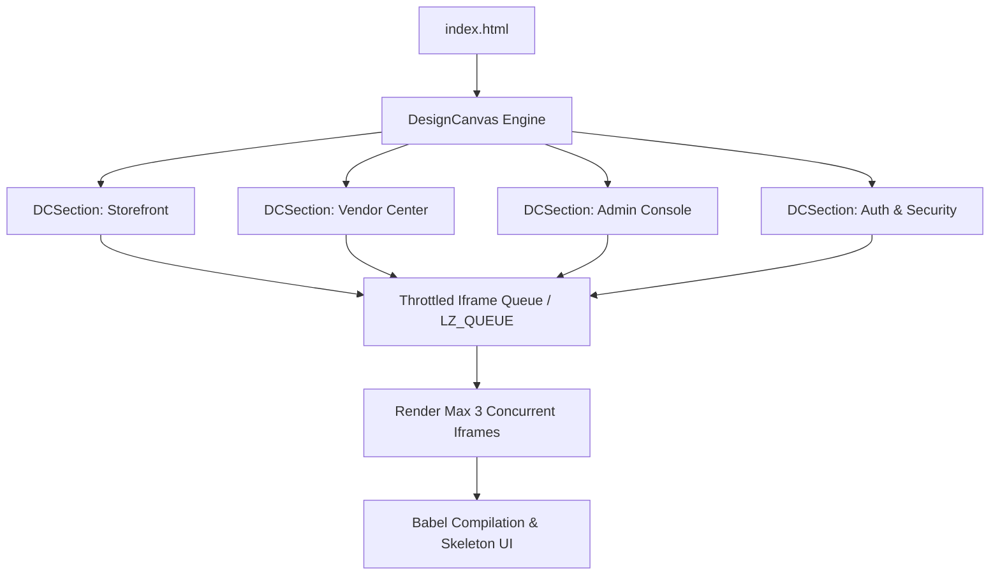

# Lazadee UI Board — Interactive Screen Board & Design Canvas

> **Repository:** `lazadee-ui-board`  
> **Platform:** Lazadee Multi-Vendor E-Commerce Platform  
> **Language Support:** [Tiếng Việt](#tiếng-việt) | [English](#english)

---

## Mục lục / Table of Contents
- [Tiếng Việt](#tiếng-việt)
  - [1. Giới thiệu tổng quan](#1-giới-thiệu-tổng-quan)
  - [2. Kiến trúc & Cơ chế vận hành](#2-kiến-trúc--cơ-chế-vận-hành)
  - [3. Danh mục phân hệ & Màn hình (UI Kits Catalog)](#3-danh-mục-phân-hệ--màn-hình-ui-kits-catalog)
  - [4. Hệ thống Design Tokens & Thành phần giao diện](#4-hệ-thống-design-tokens--thành-phần-giao-diện)
  - [5. Cấu trúc thư mục](#5-cấu-trúc-thư-mục)
  - [6. Hướng dẫn cài đặt & Chạy ứng dụng](#6-hướng-dẫn-cài-đặt--chạy-ứng-dụng)
- [English](#english)
  - [1. Executive Overview](#1-executive-overview)
  - [2. Architecture & Core Mechanisms](#2-architecture--core-mechanisms)
  - [3. UI Kits & Screen Catalog](#3-ui-kits--screen-catalog)
  - [4. Design Tokens & Component System](#4-design-tokens--component-system)
  - [5. Directory Structure](#5-directory-structure)
  - [6. Installation & Execution Guide](#6-installation--execution-guide)

---

# Tiếng Việt

## 1. Giới thiệu tổng quan

**Lazadee UI Board** là không gian làm việc thiết kế trực quan dạng Canvas vô cực (Infinite Canvas Board tương tự Figma), được xây dựng để trực quan hóa, kiểm thử và theo dõi toàn bộ hệ thống giao diện của sàn thương mại điện tử đa người bán **Lazadee**.

Dự án tổng hợp hơn 40+ artboards thuộc 4 phân hệ cốt lõi:
1. **Storefront (Khách hàng / Người mua):** Hành trình mua sắm từ khám phá sản phẩm, giỏ hàng đa shop, thanh toán voucher chồng đến theo dõi đơn hàng và quản lý tài khoản.
2. **Vendor Center (Kênh Người bán):** Trung tâm quản trị bán hàng, xác thực KYC, xử lý đơn vận, quản lý ví Escrow và cấu hình khuyến mãi.
3. **Admin Console (Quản trị sàn):** Hệ thống hậu cần vận hành, duyệt hồ sơ KYC, trọng tài giải quyết khiếu nại/hoàn tiền, quản lý sổ cái tài chính và phân quyền nhân viên RBAC.
4. **Authentication & Security (Xác thực & Bảo mật):** Luồng đăng nhập bằng số điện thoại/OTP 6 chữ số, cơ chế tự động khóa tài khoản sau 5 lần nhập sai và phục hồi quyền truy cập.

---

## 2. Kiến trúc & Cơ chế vận hành

UI Board được thiết kế với kiến trúc **Zero-Build Runtime**, chạy trực tiếp trên trình duyệt bằng React 18 UMD và Babel Standalone, không yêu cầu cài đặt bundle tool nặng nề (Webpack/Vite/Rollup).



### Các tính năng kỹ thuật nổi bật:
- **Infinite 2D Pan & Zoom Canvas:** Hỗ trợ thu phóng mượt mà từ `0.06x` đến `2.0x`, kéo thả nền (Pan), căn chỉnh vị trí tự động và phím tắt thao tác nhanh.
- **Throttled Iframe Loader Queue (`LZ_QUEUE`):** Khi hiển thị hàng chục màn hình phức tạp cùng lúc, hệ thống kiểm soát chỉ cho phép tối đa 3 iframes khởi động và biên dịch đồng thời (`LZ_MAX = 3`), kèm khoảng đệm 500ms (`LZ_GAP = 500ms`) để tránh gây tràn RAM hoặc nghẽn CPU.
- **Skeleton Loading State:** Hiển thị màn hình chờ mượt mà theo từng tông màu giao diện của từng phân hệ (Storefront sáng, Vendor tối, Admin xanh đậm) trong khi nạp iframes.
- **Viewport State Persistence:** Tự động lưu vị trí tọa độ `(x, y)` và tỉ lệ thu phóng `scale` vào `localStorage`, khôi phục chính xác góc nhìn khi tải lại trang kèm nút bấm *Về vị trí ban đầu*.
- **Focus Overlay & Frame Inspection:** Cho phép xem chi tiết từng màn hình độc lập toàn màn hình.

---

## 3. Danh mục phân hệ & Màn hình (UI Kits Catalog)

### 3.1. Phân hệ Khách hàng (Storefront)
| Mã màn hình | Tên màn hình / Trạng thái | Mô tả nghiệp vụ |
| :--- | :--- | :--- |
| `home` | Trang chủ sàn | Header toàn diện, Banner trượt, Danh mục ngành hàng, Flash Sale, Gợi ý sản phẩm. |
| `discover` | Gợi ý hôm nay (Phân trang) | Tải thêm danh sách sản phẩm theo hành vi người dùng, lọc nâng cao. |
| `product` | Chi tiết sản phẩm | Thư viện ảnh/video, chọn phân loại (Variant), bảng giá động, đánh giá từ khách hàng, gợi ý liên quan. |
| `cart` | Giỏ hàng đa người bán | Tự động phân nhóm sản phẩm theo từng Shop, chọn mua linh hoạt theo shop hoặc toàn giỏ. |
| `checkout` | Thanh toán gộp & Voucher chồng | Áp dụng đồng thời 3 tầng giảm giá: Voucher Sàn + Voucher Shop + Mã Freeship. |
| `checkout-address`| Sổ địa chỉ nhận hàng | Modal thay đổi địa chỉ mặc định, thêm mới địa chỉ 3 cấp hành chính (Tỉnh/Huyện/Xã). |
| `checkout-oos` | Xử lý hết hàng giữa chừng | Bắt lỗi `ERR_STOCK_UNAVAILABLE` khi tồn kho bị giữ bởi phiên khác, gợi ý cập nhật giỏ. |
| `payfail` | Thanh toán thất bại | Báo lỗi thanh toán cổng điện tử (`PAYMENT_FAILED`), cho phép chọn phương thức khác. |
| `done` | Đặt hàng thành công | Hiển thị mã đơn hàng tách theo shop, hướng dẫn thanh toán, nút tiếp tục mua sắm. |
| `account` | Đơn mua của tôi | Quản lý toàn bộ đơn hàng theo tab: Tất cả, Chờ thanh toán, Đang giao, Đã giao, Đã hủy, Trả hàng. |
| `account-notifications` | Trung tâm thông báo | Thông báo cập nhật đơn hàng, khuyến mãi sàn, biến động số dư xu. |
| `account-profile` | Hồ sơ cá nhân | Cập nhật họ tên, email, số điện thoại, ngày sinh, giới tính, ảnh đại diện. |
| `account-address` | Quản lý sổ địa chỉ | Danh sách địa chỉ nhận hàng, gắn nhãn Văn phòng / Nhà riêng, đặt mặc định. |
| `account-password` | Đổi mật khẩu | Đổi mật khẩu định kỳ với thanh đo độ mạnh mật khẩu và mã OTP xác minh. |
| `account-devices` | Quản lý thiết bị đăng nhập | Danh sách phiên đăng nhập, IP, vị trí địa lý, nút đăng xuất từ xa bảo vệ tài khoản. |
| `account-vouchers` | Kho Voucher cá nhân | Danh sách mã giảm giá đã lưu, phân loại theo Sàn / Shop / Vận chuyển. |
| `account-coins` | Lazadee Xu | Lịch sử cộng/trừ xu, điểm danh nhận xu, đổi xu lấy voucher. |
| `account-follow` | Shop đang theo dõi | Danh sách nhà bán hàng yêu thích, cập nhật sản phẩm mới từ shop. |
| `tracking` | Theo dõi đơn hàng (Đang giao) | Hành trình bưu kiện thời gian thực theo từng mốc thời gian từ đơn vị vận chuyển (3PL). |
| `tracking-delivered`| Xác nhận giao hàng / Đổi trả | Trạng thái giao thành công, kích hoạt luồng Đã nhận hàng hoặc Yêu cầu Trả hàng/Hoàn tiền. |
| `shop` | Trang hồ sơ Shop | Xem thông tin cửa hàng, tỉ lệ phản hồi chat, đánh giá, danh mục sản phẩm riêng của shop. |
| `search` | Tìm kiếm sản phẩm | Bộ lọc đa chiều: Khoảng giá, Nơi bán, Đánh giá sao, Phân loại Shop Mall, Freeship Xtra. |
| `seller` | Đăng ký Người bán mới | Landing page giới thiệu chính sách, biểu phí hoa hồng và nút bắt đầu mở shop. |

### 3.2. Phân hệ Người bán (Vendor / Seller Center)
| Mã màn hình | Tên màn hình / Trạng thái | Mô tả nghiệp vụ |
| :--- | :--- | :--- |
| `overview` | Tổng quan kinh doanh | Báo cáo doanh thu, đơn hàng cần xử lý, tỉ lệ chuyển đổi, biểu đồ doanh số 7 ngày gần nhất. |
| `wallet` | Ví tiền & Sổ cái Escrow | Theo dõi số dư khả dụng, số dư tạm giữ (Escrow Held), lịch sử khấu trừ hoa hồng và rút tiền (Payout). |
| `kyc` | Định danh người bán (KYC) | Nộp giấy tờ tùy thân (CCCD/CMND), giấy phép kinh doanh (GPKD/ĐKKD), tài khoản ngân hàng thụ hưởng. |
| `products` | Quản lý sản phẩm | Danh sách sản phẩm, quản lý tồn kho, chỉnh sửa SKU, cập nhật giá bán, trạng thái ẩn/hiện. |
| `orders` | Xử lý đơn hàng & Giao vận | Quy trình xử lý đơn: Chờ xác nhận -> Đóng gói -> In vận đơn -> Bàn giao đơn vị vận chuyển. |
| `chat` | Kênh trò chuyện khách hàng | Trực tiếp hỗ trợ khách hàng, gửi thẻ sản phẩm, gửi voucher nhanh trong khung chat. |
| `promo` | Khuyến mãi của Shop | Thiết lập mã giảm giá riêng của shop, chương trình giảm giá theo số lượng, combo mua kèm. |
| `reviews` | Đánh giá & Phản hồi | Quản lý nhận xét của khách hàng, phản hồi đánh giá 1-5 sao, báo cáo đánh giá vi phạm. |
| `stats` | Phân tích nâng cao | Thống kê lượt truy cập gian hàng, tỉ lệ xem sản phẩm, mặt hàng bán chạy nhất. |
| `settings` | Cài đặt cửa hàng | Cấu hình địa chỉ kho lấy hàng, thời gian hoạt động, chế độ tạm nghỉ (Vacation Mode). |

### 3.3. Phân hệ Quản trị Sàn (Admin Console)
| Mã màn hình | Tên màn hình / Trạng thái | Mô tả nghiệp vụ |
| :--- | :--- | :--- |
| `kyc` | Hàng đợi duyệt KYC | Danh sách hồ sơ chờ duyệt, kiểm tra ảnh CCCD/GPKD, phân loại rủi ro (Low/Medium/High), Duyệt / Từ chối kèm lý do / Yêu cầu bổ sung. |
| `refunds` | Trọng tài khiếu nại & Hoàn tiền | Xem chứng từ/hình ảnh lỗi từ người mua, quyết định chấp thuận hoàn tiền qua VNPAY hoặc từ chối khiếu nại. |
| `withdrawals` | Duyệt lệnh rút tiền (Payout) | Kiểm tra tính hợp lệ của số dư ví vendor, kiểm tra trạng thái KYC, duyệt chuyển khoản ngân hàng. |
| `commission` | Cấu hình biểu phí hoa hồng | Thiết lập % hoa hồng sàn theo từng ngành hàng (Điện tử 5%, Thời trang 8%, Gia dụng 6%...). |
| `ledger` | Sổ cái kế toán sàn | Bảng đối soát tài chính bất biến: `ESCROW_IN`, `COMMISSION`, `ESCROW_RELEASE`, `PAYOUT_SETTLE`, `REFUND`. |
| `reviews` | Kiểm duyệt nội dung | Bộ lọc tự động phát hiện ngôn từ tiêu cực/thô tục hoặc spam số điện thoại, ẩn đánh giá vi phạm. |
| `catalog` | Quản lý danh mục sàn | Cây danh mục sản phẩm toàn sàn, thêm/sửa/xóa ngành hàng và thuộc tính bắt buộc. |
| `vouchers` | Quản lý Voucher sàn | Tạo chiến dịch khuyến mãi toàn sàn, tài trợ mã Freeship, thiết lập ngân sách và thời hạn sử dụng. |
| `audit` | Nhật ký hệ thống (Audit Trail)| Ghi nhận mọi hành động nhạy cảm của nhân viên sàn (thời gian, email, hành động, ID đối tượng, IP). |
| `rbac` | Phân quyền nhân viên (RBAC) | Cấp quyền theo nhóm vai trò (Super Admin, KYC Reviewer, Finance Staff, Moderator, CS Support). |
| `account` | Hồ sơ cá nhân quản trị viên | Quản lý thông tin tài khoản đăng nhập admin, đổi mật khẩu và xem quyền hạn được cấp. |

### 3.4. Phân hệ Xác thực (Auth & Security)
| Mã màn hình | Tên màn hình / Trạng thái | Mô tả nghiệp vụ |
| :--- | :--- | :--- |
| `login` | Đăng nhập tài khoản | Đăng nhập bằng Số điện thoại/Email & Mật khẩu hoặc Đăng nhập nhanh qua Google/Apple. |
| `register` | Đăng ký tài khoản mới | Đăng ký với họ tên, số điện thoại, email, kiểm tra độ an toàn mật khẩu (Password Strength Meter). |
| `forgot` | Quên mật khẩu | Nhập thông tin tài khoản để nhận mã khôi phục mật khẩu. |
| `otp` | Xác thực mã OTP | Nhập mã OTP 6 số với cơ chế tự động chuyển ô (Auto-focus next input), đếm ngược thời gian hết hạn mã. |
| `locked` | Tài khoản bị tạm khóa | Kích hoạt cảnh báo bảo mật khi nhập sai OTP/Mật khẩu quá 5 lần liên tiếp. |

---

## 4. Hệ thống Design Tokens & Thành phần giao diện

Toàn bộ giao diện được chuẩn hóa thông qua hệ thống token định nghĩa tại `lazadee/tokens/`:
- **Bảng màu (Colors):**
  - Brand Primary: `--orange-500` (`#F5511E`), dải màu từ `--orange-50` đến `--orange-700`.
  - Secondary Accents: `--blue-500` (`#2563EB`), `--green-500` (`#14B86E`), `--purple-500` (`#6C2BD9`).
  - Semantic Status: `--green-600` (Success/Verified), `--yellow-600` (Warning/Pending), `--red-600` (Danger/Rejected), `--blue-600` (Info).
  - Neutrals: Dải màu trung tính từ `--gray-50` đến `--ink-900` (`#14171F`).
- **Phông chữ (Typography):**
  - Body & Heading: `Be Vietnam Pro` (chữ nét chuẩn tiếng Việt có dấu, độ dày 400 - 800).
  - Monospace & Numbers: `IBM Plex Mono` (sử dụng cho giá tiền, mã đơn hàng, log hệ thống, mã OTP).
- **Độ bo góc (Border Radius):** `--radius-xs` (3px), `--radius-sm` (5px), `--radius-md` (8px), `--radius-lg` (12px), `--radius-pill` (9999px).
- **Hiệu ứng đổ bóng (Elevation & Shadows):** Từ `--shadow-xs` đến `--shadow-xl` tạo chiều sâu phân cấp thông tin.

---

## 5. Cấu trúc thư mục

```text
canvas/
├── index.html                  # Điểm khởi chạy Canvas Board (Chứa Viewport Logic & Script Loader)
├── README.md                   # Tài liệu kỹ thuật chi tiết của repository
└── lazadee/
    ├── board.jsx               # Danh mục cấu hình toàn bộ Artboards & Layout theo Section
    ├── design-canvas.jsx       # Component lõi quản lý Pan/Zoom, Artboard Grid, Drag-and-Drop
    ├── shell.jsx               # Prototype Launcher Shell (Dùng chung cho Preview)
    ├── styles.css              # Reset CSS & biến giao diện tổng thể
    ├── tweaks-panel.jsx        # Bảng điều khiển tùy chỉnh theme
    ├── _ds_bundle.js           # Bundle các component Lazadee Design System (Icon, Button, Input...)
    ├── assets/
    │   ├── fonts/              # Bộ font cục bộ Be Vietnam Pro & IBM Plex Mono dạng WOFF2
    │   ├── img/                # Ảnh sản phẩm mẫu chất lượng cao & banner sàn
    │   └── logomark.svg        # Logo thương hiệu Lazadee
    ├── components/
    │   └── lazadee-components.css # Style chuẩn của các UI Component
    ├── tokens/
    │   ├── base.css            # Biến cơ sở
    │   ├── colors.css          # Bảng mã màu chuẩn
    │   ├── effects.css         # Shadow, Transition, Focus ring
    │   ├── fonts.css           # Cấu hình nạp webfont cục bộ
    │   ├── spacing.css         # Thước đo khoảng cách
    │   └── typography.css      # Cỡ chữ và Line height
    └── ui_kits/
        ├── admin/              # UI Kit phân hệ Quản trị Sàn
        ├── auth/               # UI Kit phân hệ Xác thực & Bảo mật
        ├── storefront/         # UI Kit phân hệ Người mua hàng
        └── vendor/             # UI Kit phân hệ Kênh Người bán
```

---

## 6. Hướng dẫn cài đặt & Chạy ứng dụng

Dự án không có phụ thuộc Node.js build-step phức tạp. Bạn có thể mở trực tiếp hoặc phục vụ qua bất kỳ Web Server tĩnh nào.

### Cách 1: Mở trực tiếp bằng Trình duyệt
- Click đúp chuột vào file `canvas/index.html` hoặc kéo thả vào Google Chrome, Microsoft Edge, Firefox, Safari.

### Cách 2: Chạy với VS Code Live Server
- Mở thư mục `canvas` trong Visual Studio Code.
- Chuột phải vào `index.html` -> Chọn **Open with Live Server**.

### Cách 3: Chạy qua Python HTTP Server
```bash
# Di chuyển vào thư mục canvas
cd canvas

# Khởi chạy máy chủ HTTP tĩnh tại cổng 3000
python -m http.server 3000
```
Truy cập trình duyệt tại địa chỉ: `http://localhost:3000`

---
---

# English

## 1. Executive Overview

**Lazadee UI Board** is an interactive, infinite visual design canvas (Figma-style Screen Board) engineered to visualize, inspect, and benchmark all user interfaces across the **Lazadee Multi-Vendor E-Commerce Platform**.

The repository brings together over 40+ high-fidelity live artboards structured into 4 major enterprise subsystems:
1. **Storefront (Buyer Experience):** Complete shopping lifecycle from item discovery, multi-vendor cart partitioning, multi-tier voucher stacking to step-by-step parcel tracking and account security management.
2. **Vendor Center (Seller Portal):** Merchant command center encompassing business performance telemetry, KYC onboarding, fulfillment operations, escrow wallet settlement, and store campaigns.
3. **Admin Console (Platform Operations):** Internal operational back-office for merchant KYC auditing, dispute/refund arbitration, immutable financial ledger tracking, platform-wide voucher scheduling, and staff RBAC administration.
4. **Authentication & Security:** Phone/Email authentication, 6-digit OTP verification, automated account lockout safeguards after 5 consecutive failed attempts, and credential recovery.

---

## 2. Architecture & Core Mechanisms

The UI Board is architected upon a **Zero-Build Runtime** methodology, executing natively in modern web browsers powered by React 18 UMD and Babel Standalone without requiring bundlers (Webpack, Vite, Rollup).



### Core Technical Capabilities:
- **Infinite 2D Pan & Zoom Canvas:** Smooth scaling ranging from `0.06x` to `2.0x`, background panning, automatic alignment snapping, and responsive viewport reset handlers.
- **Throttled Iframe Loader Queue (`LZ_QUEUE`):** When rendering dozens of live interactive React applications concurrently, an asynchronous throttle queue guarantees that at most 3 iframes boot simultaneously (`LZ_MAX = 3`) with a 500ms cool-down gap (`LZ_GAP = 500ms`). This prevents CPU throttling and Babel compilation memory spikes.
- **Surface-Themed Skeleton States:** Displays tailored skeleton loading states matching each subsystem's brand palette (Storefront Light, Vendor Dark, Admin Deep Navy) while iframes are compiling.
- **Viewport State Persistence:** Persists `(x, y)` coordinate transformations and `scale` factor into `localStorage`, resuming exact user viewing positions on page refresh.
- **Focus Overlay Inspection:** Deep inspection overlay allowing developers to review individual artboards in full resolution.

---

## 3. UI Kits & Screen Catalog

### 3.1. Storefront Subsystem (Buyer)
| Screen Key | Name / State | Business Description |
| :--- | :--- | :--- |
| `home` | Marketplace Homepage | Full navigation header, carousel banners, category grids, Flash Sales, personalized recommendation feeds. |
| `discover` | Daily Recommendations | Infinite pagination feed, categorized filters, personalized shopping suggestions. |
| `product` | Product Detail (PDP) | Multi-angle media gallery, dynamic variant selector, tier pricing, buyer reviews, related items. |
| `cart` | Multi-Vendor Cart | Automatic item grouping by merchant, selective vendor checkout, quantity recalculation. |
| `checkout` | Consolidated Checkout | 3-tier stacked coupon engine: Platform Coupon + Shop Voucher + Free Shipping Code. |
| `checkout-address`| Address Selector Modal | Administrative 3-tier address selector (Province/District/Ward), default address tag. |
| `checkout-oos` | Mid-Checkout Stockout | Intercepts `ERR_STOCK_UNAVAILABLE` when concurrent purchases exhaust stock during soft-lock. |
| `payfail` | Payment Failed Intercept | Graceful gateway rejection handling (`PAYMENT_FAILED`) with alternative payment channel switching. |
| `done` | Order Success | Multi-vendor order breakdown, payment receipt summary, continuous shopping routing. |
| `account` | Customer Orders | Order history segregated by status: All, Unpaid, Shipping, Delivered, Cancelled, Returned. |
| `account-notifications` | Notification Feed | Order state updates, promotional campaigns, coin activity notifications. |
| `account-profile` | Profile Management | Personal info editor, verified email/phone badges, avatar upload. |
| `account-address` | Address Book | Stored delivery addresses, Office/Home categorizations, default address toggles. |
| `account-password` | Password Security | Credential update with real-time entropy calculation and OTP verification. |
| `account-devices` | Device Session Manager | Active session inspection, device type detection, IP address, geographic location, remote session revocation. |
| `account-vouchers` | Voucher Wallet | Stored discount coupons filtered by Platform, Merchant, and Free Shipping. |
| `account-coins` | Lazadee Coins Ledger | Reward point transaction history, daily check-in rewards, discount redemptions. |
| `account-follow` | Followed Stores | Subscribed seller list with real-time notifications on new product launches. |
| `tracking` | Real-time Parcel Tracking | Step-by-step courier timeline integration (3PL) with localized milestone events. |
| `tracking-delivered`| Order Receipt & Return | Delivered confirmation state initiating order completion or return/refund claims. |
| `shop` | Merchant Storefront | Shop metrics, chat response rate, overall rating, merchant catalog search. |
| `search` | Multi-Facet Search | Comprehensive search filtering by price range, origin, star rating, Mall badge, Free Shipping. |
| `seller` | Merchant Registration | Onboarding portal detailing platform benefits, fee structures, and merchant registration initiation. |

### 3.2. Vendor Subsystem (Seller Center)
| Screen Key | Name / State | Business Description |
| :--- | :--- | :--- |
| `overview` | Merchant Dashboard | Gross merchandise value (GMV), pending orders, conversion rates, 7-day revenue trendlines. |
| `wallet` | Escrow Wallet & Ledger | Available balance, Escrow Held funds, platform commission deductions (5%), payout requests. |
| `kyc` | Merchant Identity (KYC) | Identity submission (National ID / Business License / Tax certificate), banking verification. |
| `products` | Product Catalog CRUD | Inventory management, SKU variation matrix, dynamic pricing, listing status controls. |
| `orders` | Order Fulfillment | Operational pipeline: Unfulfilled -> Pick & Pack -> Airway Bill Generation -> 3PL Handover. |
| `chat` | Customer Live Support | Real-time buyer communications, product card embedding, one-click voucher distribution. |
| `promo` | Store Promotions | Self-funded store coupons, volume discounts, bundled deal configurations. |
| `reviews` | Feedback & Rating Moderation | Customer review monitoring, 1-5 star replies, dispute reporting for malicious reviews. |
| `stats` | Business Analytics | Store traffic metrics, PDP view conversions, top-performing product performance. |
| `settings` | Shop Settings | Pickup warehouse address, business hours, holiday vacation mode. |

### 3.3. Admin Subsystem (Console)
| Screen Key | Name / State | Business Description |
| :--- | :--- | :--- |
| `kyc` | KYC Review Queue | Queue of pending merchant submissions, ID inspection, risk categorizations (Low/Med/High), Approve/Reject/Supplement. |
| `refunds` | Dispute & Refund Arbitration | Review buyer photographic evidence, dispute reasons, gateway-level refund trigger (VNPAY). |
| `withdrawals` | Payout Processing | Merchant withdrawal validation against KYC status and escrow balances, bank disbursement approvals. |
| `commission` | Category Commission Rates | Platform fee configuration partitioned by category (Electronics 5%, Fashion 8%, Home 6%...). |
| `ledger` | Platform Financial Ledger | Immutable double-entry audit log: `ESCROW_IN`, `COMMISSION`, `ESCROW_RELEASE`, `PAYOUT_SETTLE`, `REFUND`. |
| `reviews` | Review Moderation | Automated spam/profanity detection, phone number leakage filtering, review masking. |
| `catalog` | Global Category Hierarchy | Marketplace taxonomy management, mandatory attribute schemas, subcategory trees. |
| `vouchers` | Platform Voucher Engine | Campaign coupon creation, platform-sponsored free shipping codes, budget caps, date scheduling. |
| `audit` | System Audit Trail | Immutable log of administrative operations (timestamp, admin email, action, entity ID, remote IP). |
| `rbac` | Role-Based Access Control | Granular permission assignment across system roles (Super Admin, KYC Reviewer, Finance, Moderator, CS). |
| `account` | Admin Profile | Active administrative profile view, permission matrix overview, credential settings. |

### 3.4. Authentication Subsystem (Auth & Security)
| Screen Key | Name / State | Business Description |
| :--- | :--- | :--- |
| `login` | User Authentication | Phone/Email & Password credential authentication alongside Google & Apple OAuth options. |
| `register` | Account Registration | User sign-up with real-time password entropy scoring and terms agreement. |
| `forgot` | Credential Recovery | Secure password reset initiation through verified phone/email channels. |
| `otp` | 6-Digit OTP Verification | Secure OTP input field featuring automated digit advancement and countdown expiry timers. |
| `locked` | Security Account Lockout | Automated security lockout state triggered following 5 successive invalid credential attempts. |

---

## 4. Design Tokens & Component System

The entire UI is governed by centralized design tokens located in `lazadee/tokens/`:
- **Color Palette:**
  - Brand Primary: `--orange-500` (`#F5511E`), stepped from `--orange-50` through `--orange-700`.
  - Secondary Accents: `--blue-500` (`#2563EB`), `--green-500` (`#14B86E`), `--purple-500` (`#6C2BD9`).
  - Semantic Status: `--green-600` (Success/Verified), `--yellow-600` (Warning/Pending), `--red-600` (Danger/Rejected), `--blue-600` (Info).
  - Neutrals: Cohesive grayscale ranging from `--gray-50` to `--ink-900` (`#14171F`).
- **Typography:**
  - Primary Sans: `Be Vietnam Pro` (complete Vietnamese diacritics support, font-weight 400 - 800).
  - Monospace: `IBM Plex Mono` (financial numerals, order identifiers, audit logs, OTP fields).
- **Border Radii:** `--radius-xs` (3px), `--radius-sm` (5px), `--radius-md` (8px), `--radius-lg` (12px), `--radius-pill` (9999px).
- **Elevation & Shadows:** Tokenized shadow depths from `--shadow-xs` to `--shadow-xl`.

---

## 5. Directory Structure

```text
canvas/
├── index.html                  # Canvas Board Entrypoint (Viewport Logic & Script Loader)
├── README.md                   # Technical Documentation
└── lazadee/
    ├── board.jsx               # Artboards Catalogue & Section Grid Configurations
    ├── design-canvas.jsx       # Pan/Zoom Engine, Artboard Layout, Drag-and-Drop
    ├── shell.jsx               # Prototype Launcher Shell (Reusable Base)
    ├── styles.css              # Global Reset & Master CSS Variables
    ├── tweaks-panel.jsx        # Live Theme & Radius Configuration Panel
    ├── _ds_bundle.js           # Lazadee Design System Component Bundle
    ├── assets/
    │   ├── fonts/              # Local WOFF2 Webfonts (Be Vietnam Pro & IBM Plex Mono)
    │   ├── img/                # High-res Mock Product Photography & Banners
    │   └── logomark.svg        # Lazadee Brand Vector
    ├── components/
    │   └── lazadee-components.css # Component Master Stylesheets
    ├── tokens/
    │   ├── base.css            # Base Tokens
    │   ├── colors.css          # Color Swatches & Status Tokens
    │   ├── effects.css         # Shadows, Transitions, Focus Rings
    │   ├── fonts.css           # Local Font Face Declarations
    │   ├── spacing.css         # Spacing Scales
    │   └── typography.css      # Font Sizes & Leading Scales
    └── ui_kits/
        ├── admin/              # Admin Console UI Kit
        ├── auth/               # Authentication & Security UI Kit
        ├── storefront/         # Buyer Storefront UI Kit
        └── vendor/             # Seller Center UI Kit
```

---

## 6. Installation & Execution Guide

The project requires zero compilation and zero Node.js dependencies.

### Option 1: Native Browser Launch
- Double-click `canvas/index.html` or drag it into any modern web browser (Google Chrome, Microsoft Edge, Firefox, Safari).

### Option 2: Visual Studio Code Live Server
- Open the `canvas` folder in VS Code.
- Right-click `index.html` -> Click **Open with Live Server**.

### Option 3: Python Static Server
```bash
# Navigate to canvas root
cd canvas

# Launch static HTTP server on port 3000
python -m http.server 3000
```
Open `http://localhost:3000` in your web browser.
